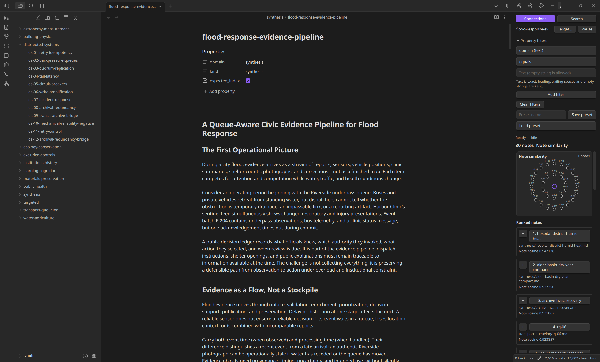
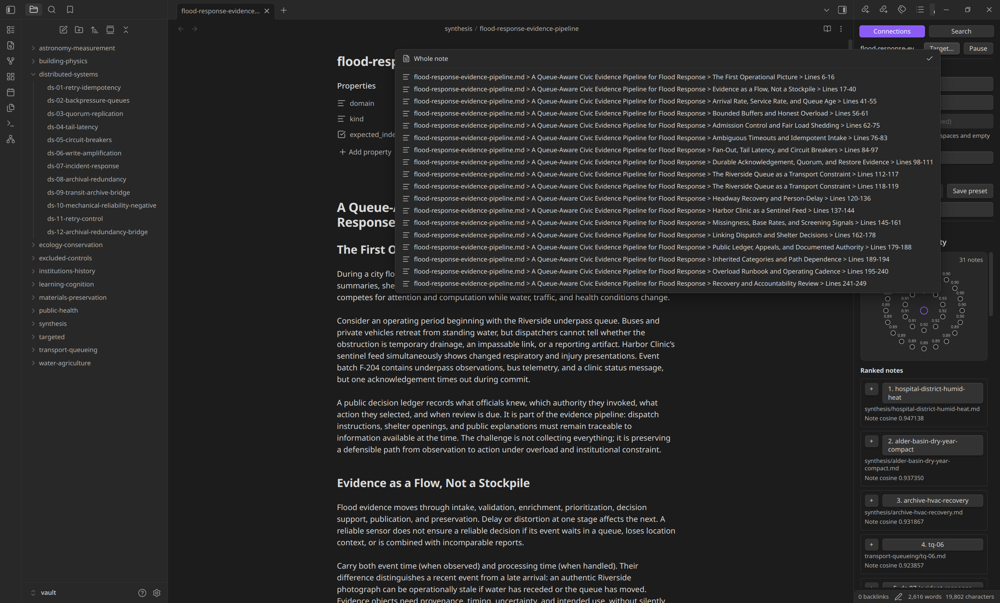

# Local Semantic Search

I made this to study chunking, late chunking, and embeddings. It ended up as a desktop Obsidian plugin. Models run locally through Transformers.js; Weaviate stores the vectors and handles retrieval.

Personal experiment. Not a polished product.

## What it does

- **Standard chunking:** split Markdown around its structure, then embed each passage separately.
- **Late chunking:** encode a larger context window first, then pool each passage's token embeddings. Same passage boundaries, different context. Jina only.
- **Connections:** related notes using cosine similarity, from the whole note or a selected passage.
- **Search:** Weaviate hybrid retrieval — keyword search plus vectors.

Models: Granite 97M R2 (default), MiniLM L6 v2, and Jina Embeddings v2 Small. Standard is the default mode. Jina uses 3,584-token runtime windows here, not its advertised 8,192 positions. Longer notes are split across windows; changing model or chunking mode rebuilds the index. Used Jina for late chunking due to its mean pooling, Granite R2 does CLS chunking and it's not suited to late chunking.


## In Obsidian

Connections keeps the current note visible beside related notes and their cosine scores.



The connection target can be the whole note or a specific Markdown passage.


## Try it

You need desktop Obsidian, Node.js 22+, and working Podman or Docker.

```sh
npm install
npm run package
```

Copy `release/local-semantic-search` into a test vault's `.obsidian/plugins/`, then enable the plugin. In its settings, select your container backend, model, and chunking mode, then enable semantic indexing. For Late, select Jina first. Missing model files and the Weaviate image are downloaded on first use.

Original Markdown files are not modified. Frontmatter is filter metadata, not embedding input. `#status/inbox`, `#type/private`, their subtags, and `ai_index: false` are excluded. Weaviate is authenticated and loopback-only; managed data and credentials live outside the vault. Unloading the plugin leaves Weaviate running.

## Poorly explained benchmarks

Local Jina v2 Small runs, fp32, 3,584-token windows. The main retrieval benchmarks use LLM relevance labels, not human ground truth. nDCG@10 roughly means “did the relevant notes end up near the top?” Higher is better.

### Actual Obsidian Search

These used the packaged plugin's Search UI and Weaviate hybrid ranking.

| Experiment | Result | Rough reading |
| --- | --- | --- |
| Broad corpus: 125 notes, 40 queries | Standard nDCG **0.7993**, Late **0.8053**. Both **97.5%** relevant at rank 1. | Basically a tie. The nDCG difference's 95% interval crosses zero. |
| Context-dependent queries: 175 notes, 152 queries | Late **+0.0073 nDCG** overall; 95% interval **[+0.0008, +0.0153]**. Same-window medium notes: **+0.0125**. | Small gain on this deliberately constructed dataset. Across-window cases were slightly worse. |

### Offline experiments

These are cosine-ranking experiments, not more runs of the hybrid Search UI. Different setups; don't compare scores across rows as if they were one leaderboard.

| Experiment | Result | Rough reading |
| --- | --- | --- |
| Selected passage vs whole-note Connections: 102 cases | Late selected passage **0.7081 nDCG**, whole note **0.6577**. Standard selected passage **0.6642**. | Picking a passage helped Late here. An LLM picked the passages, not real users. |
| Smaller paragraph chunks: 120 notes | **469 → 1,717** passages; Late nDCG **0.8476 → 0.8484**. | 3.66× as many vectors, no reliable retrieval gain. |
| Less context around each passage | ±128 tokens: **0.7331** Connections nDCG vs full-window Late **0.7081**; **2.03×** encoded tokens. | Promising, but recomputing overlapping context isn't free. |
| Controlled window seams: 20 synthetic cases | Late nDCG: same window **0.9124**, split windows **0.6138**, 512-token overlap **0.9309**. | Overlap recovered context in this tiny controlled setup. Not proof it helps a real vault. |

My takeaway: late chunking can help when a passage needs nearby context. More context, smaller chunks, and overlap are not automatic upgrades. Standard stays the default; context-radius and overlap variants above are not implemented in the plugin.

The benchmark scripts, datasets, and raw results are **not included in this repo**, so these are notes from local runs, not a reproducible benchmark release.

## Checks

```sh
npm run typecheck
npm test
npm run package
```
